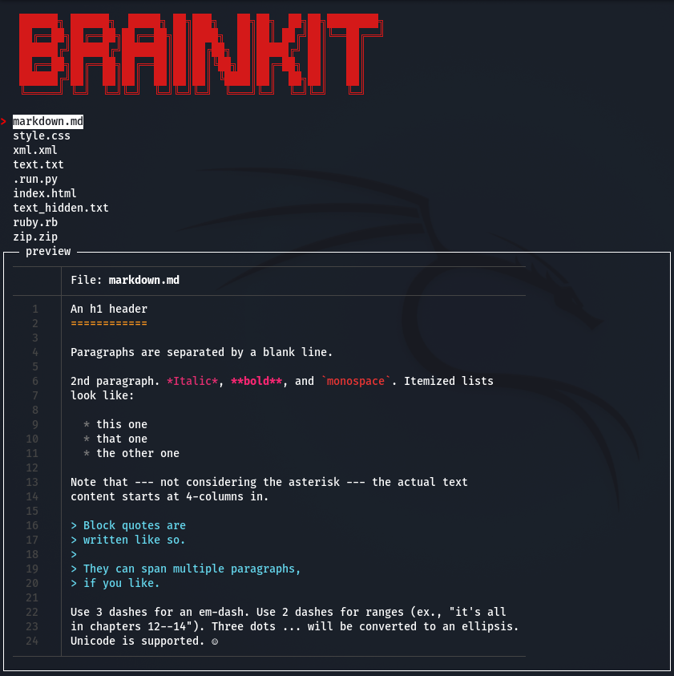

<div id="top"></div>
<!-- PROJECT LOGO -->
<br />
<div align="center">
  <a href="https://github.com/jeroen66124/Brainkit">
    
  </a>

  <h1 align="center">Brainkit</h1>

  <p align="center">
    A file-view tool which can be used for pretty much anything,<br />with customizable database and fast preview function for the command line!
    <br /><br />
    <a href="https://github.com/jeroen66124/Brainkit/tree/main/brainkit"><strong>Explore the tool »</strong></a>
    <br />
    <br />
    <a href="https://github.com/jeroen66124/Brainkit#about-the-project">View Demo</a>
    ·
    <a href="https://github.com/jeroen66124/Brainkit/issues">Report Bug</a>
    ·
    <a href="https://github.com/jeroen66124/Brainkit/issues">Request Feature</a>
  </p>
</div>


<!-- TABLE OF CONTENTS -->
<details>
  <summary><strong>Table of Contents</strong></summary>
  <ol>
    <li>
      <a href="#about-the-project">About The Project</a>
      <ul>
        <li><a href="#built-with">Built With</a></li>
      </ul>
    </li>
    <li>
      <a href="#getting-started">Getting Started</a>
      <ul>
        <li><a href="#prerequisites">Prerequisites</a></li>
        <li><a href="#installation">Installation</a></li>
      </ul>
    </li>
    <li><a href="#usage">Usage</a></li>
    <li><a href="#roadmap">Roadmap</a></li>
    <li><a href="#contributing">Contributing</a></li>
    <li><a href="#license">License</a></li>
    <li><a href="#contact">Contact</a></li>
    <li><a href="#acknowledgments">Acknowledgments</a></li>
  </ol>
</details>


<!-- ABOUT THE PROJECT -->
## About The Project

<p align="center">
  
</p>

### Built With

This section lists any major frameworks/libraries used by this project.

* [Bash](https://www.gnu.org/software/bash/)
* [Python](https://www.python.org/)

<p align="right">(<a href="#top">back to top</a>)</p>


<!-- GETTING STARTED -->
## Getting Started

This is an example of how you set up the Brainkit tool.<br>
Follow the instructions to get a local copy up and running.

### Prerequisites

This is how to install the prerequisites.
* Python / Pip / Bat
  ```sh
  sudo apt install python3 python3-pip bat
  ```
  
### Installation

This is how to install Brainkit.

1. Clone the repo
   ```sh
   git clone https://github.com/jeroen66124/Brainkit.git && cd Brainkit/brainkit
   ```
2. Install pip packages
   ```sh
   pip3 install -r requirements.txt
   ```
3. Set execution permissions
   ```sh
   sudo chmod +x brainkit.sh
   ```
4. Launch Brainkit
   ```js
   ./brainkit.sh
   ```

<p align="right">(<a href="#top">back to top</a>)</p>


<!-- USAGE EXAMPLES -->
## Usage

Brainkit can be used for pretty much anything, it was originally a glorified cheat sheet which turned out to be a file-viewer with a fast preview function for the command line. You can add and remove all sorts of files to the `/database` as long as [Batcat](https://github.com/sharkdp/bat) supports it.
Once a file has been added to the database, it can be previewed quickly within the tool.

<p align="right">(<a href="#top">back to top</a>)</p>


<!-- ROADMAP -->
## Roadmap

- [ ] Turn run.py into the main executable
- [ ] Deprecate brainkit.sh as the launch script
- [ ] Support subfolders in preview function
- [ ] Compatibility with uncommon file formats
- [ ] Real time editing of previewed files

See the [open issues](https://github.com/jeroen66124/Brainkit/issues) for a full list of proposed features (and known issues).

<p align="right">(<a href="#top">back to top</a>)</p>


<!-- CONTRIBUTING -->
## Contributing

Contributions are what make the open source community such an amazing place to learn, inspire, and create. Any contributions you make are **greatly appreciated**.

If you have a suggestion that would make this better, please fork the repo and create a pull request. You can also simply open an issue with the tag "enhancement".
Don't forget to give the project a star! Thanks again!

1. Fork the Project
2. Create your Feature Branch (`git checkout -b feature/AmazingFeature`)
3. Commit your Changes (`git commit -m 'Add some AmazingFeature'`)
4. Push to the Branch (`git push origin feature/AmazingFeature`)
5. Open a Pull Request

<p align="right">(<a href="#top">back to top</a>)</p>


<!-- LICENSE -->
## License

Distributed under the MIT License. See `LICENSE.txt` for more information.

<p align="right">(<a href="#top">back to top</a>)</p>


<!-- CONTACT -->
## Contact

jeroen66124 - [@_deactivated08](https://twitter.com/_deactivated08)

Project Link: [https://github.com/jeroen66124/Brainkit](https://github.com/jeroen66124/Brainkit)

<p align="right">(<a href="#top">back to top</a>)</p>


<!-- ACKNOWLEDGMENTS -->
## Acknowledgments

Resources I have used for Brainkit and I would like to give credit to.

* [asciinema](https://asciinema.org/)
* [Best-README-Template](https://github.com/othneildrew/Best-README-Template)
* [Choose a License](https://choosealicense.com)
* [Font Awesome](https://fontawesome.com)

<p align="right">(<a href="#top">back to top</a>)</p>


<!-- MARKDOWN LINKS & IMAGES -->
<!-- https://www.markdownguide.org/basic-syntax/#reference-style-links -->
[product-screenshot]: images/screenshot.png
